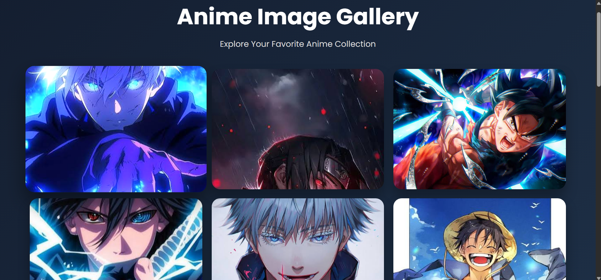

# 🎌 Anime Image Gallery

> *"Not every project has to solve a problem. Some projects are built simply because they bring a smile to your face."

---

## 📖 About

Anime has always been one of my biggest interests—not just because of the stories, but because of the incredible artwork, vibrant colors, and unforgettable characters.

While learning frontend development, I wanted to build something that reflected my own interests instead of using random placeholder images. That's how this project came to life.

This **Anime Image Gallery** features some of my favorite anime characters and wallpapers. I intentionally kept the design clean and minimal so that the artwork remains the center of attention. It's also a gallery I genuinely enjoy opening from time to time just to appreciate these amazing visuals.

Sometimes the best projects are the ones you build because you love them.

---

## ✨ Features

- 🎨 Responsive CSS Grid Layout
- 🖼️ Interactive Lightbox Viewer
- ⬅️ Previous & Next Navigation
- ✨ Smooth Hover Animations
- 📱 Fully Responsive Design
- ⌨️ Keyboard Navigation
- 🚀 Lazy Loading Images
- ⬆️ Scroll-to-Top Button
- 🎯 Clean & Minimal UI

---

## 🛠️ Tech Stack

- HTML5
- CSS3
- JavaScript (Vanilla)

---

## 📸 Preview



---

## 📁 Project Structure

```
Anime-Image-Gallery/
│
├── images/
├── index.html
├── style.css
├── script.js
├── screenshot.png
└── README.md
```

---

## 🚀 Getting Started

Clone the repository

```bash
git clone https://github.com/yashashwag-en/Anime-Image-Gallery.git
```

Navigate to the project folder

```bash
cd Anime-Image-Gallery
```

Open `index.html` in your browser or use **Live Server** in VS Code.

---

## 💡 Why I Built This

This project started as a way to practice building an interactive image gallery using HTML, CSS, and JavaScript.

Instead of filling it with generic stock photos, I chose wallpapers from some of my favorite anime series. It made the project much more enjoyable to build and gave it a personal touch that reflects my interests.

Keeping the interface simple was a conscious decision—I wanted the focus to remain on the artwork rather than unnecessary visual clutter.

---

## 🌱 Future Improvements

- ❤️ Favorite Images
- 🌙 Dark / Light Mode
- 🔍 Search Functionality
- 📂 Image Categories & Filters
- 🎵 Background Music Toggle
- 🧱 Masonry Layout
- ⚡ More UI Animations
- 📥 Download Wallpaper Button

---

## 🤝 Feedback

I'm always looking to improve my frontend development skills.

If you have suggestions, ideas, or improvements, feel free to open an issue or submit a pull request.

---

## 👨‍💻 Author

**Yashashwa Garg**

GitHub: https://github.com/yashashwag-en

---

### ⭐ If you enjoyed this project, consider giving it a star!

Made with ❤️ and a love for anime.
